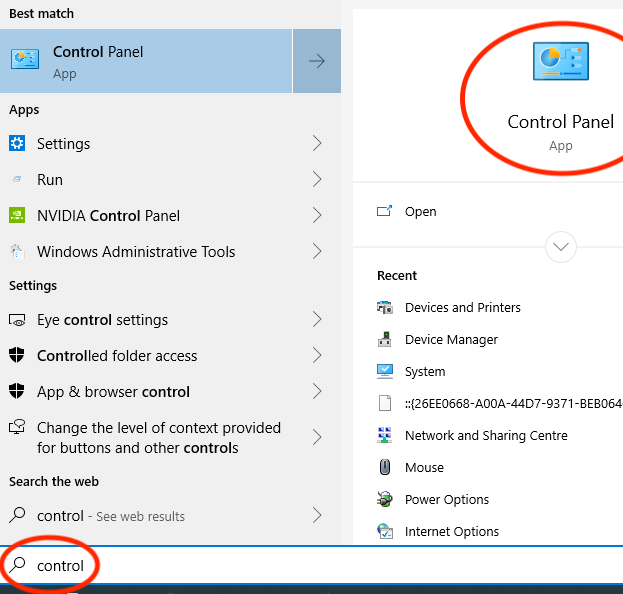
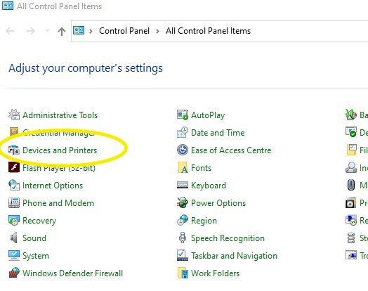
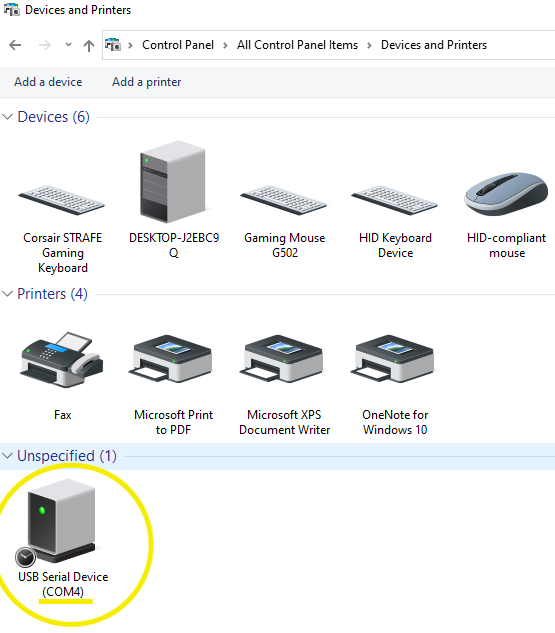
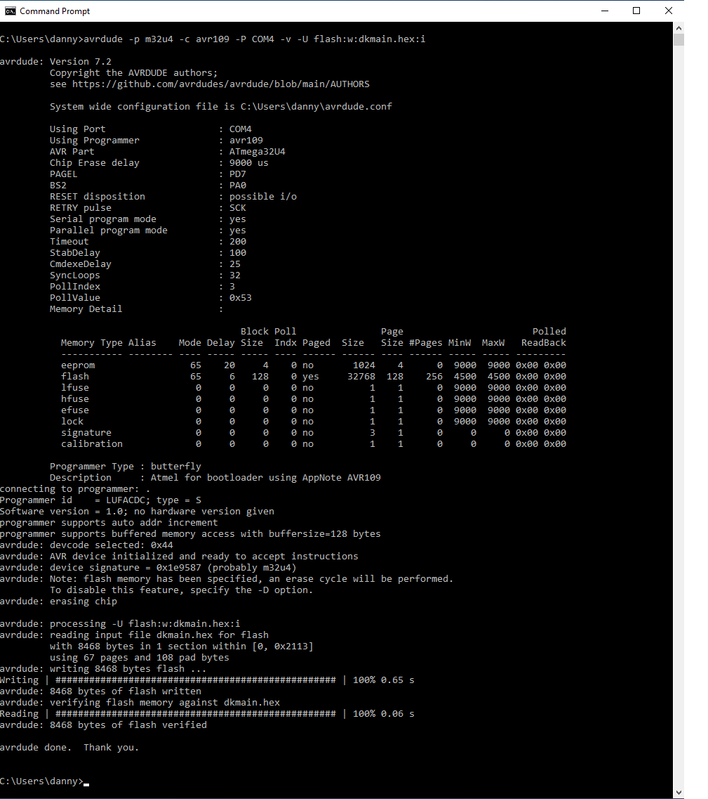
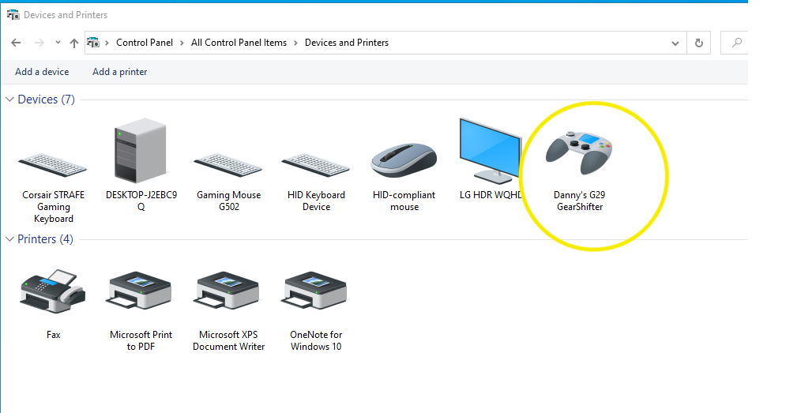

MS Windows instructions for flashing new firmware.
==================================================

Find the COMn port the atmega uses.
-----------------------------------

1. Navigate to the Control Panel.  
  

2. Select devices and printers.  
  

3. Press reset on the AVR devices and look for the com port it's using.  
  

In the example it's using COM4. We'll note that down for later use.  

NB: The this particular chip will execute the bootloader (for programming); it will timeout after about 5 seconds and boot whatever code is on the chip; this will usually mean the com port will disappear. It's ok if you miss it; just press the reset button again. :-) 


Flashing Firmware to AVR.
-------------------------

1. Download AVRDude for windows.

At time of writing, this is the latest version.  
https://github.com/avrdudes/avrdude/releases/download/v7.2/avrdude-v7.2-windows-x64.zip  

Right click - save link as.

2. Unzip contents to your home directory.  
3. Download hex file from this repo. Save into your home directory.

https://raw.githubusercontent.com/dkoreny/gearshifter/main/dkmain.hex

(right click - save as.) (save to Downloads folder)

4. Open CMD.exe; Run the following.

Replace COMn with the value you found in the section above. Since we found it on COM4, we'll use that here.

```
avrdude -p m32u4 -P COM4 -c avr109 -v -U flash:w:dkmain.hex:i
```

NB: _before_ running avrdude, press the reset button on the dev board. You have to run the above command within 6 seconds of pressing the reset button. So, type it out, but don't press enter. Press the reset button on the box, wait about 1 second, then press enter on the keyboard (to execute avrdude command)

  

Once the firmware is flashed, you should be able to see it in the "Devices and Printers" second of the control panel. i.e.:  




